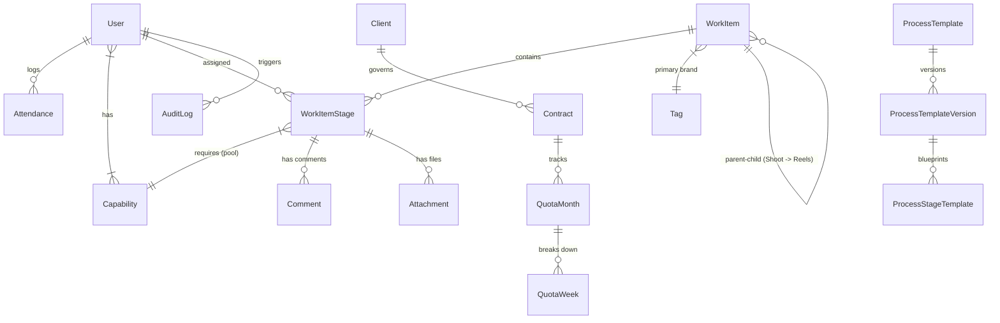

# Studio.Track - Project Structure & Schema Architecture

This document outlines the visual directory layout, sitemap, active database schema, and model relationships of the Studio.Track application.

---

## 📂 Project Directory Structure

```
StudioTrack/
├── app/                  # Next.js App Router routes, layouts, and page templates
│   ├── (auth)/           # Authentication sub-router
│   │   └── login/        # Login page credentials form
│   ├── (dashboard)/      # Protected routes wrapper (requires authentication)
│   │   ├── calendar/     # Operational calendar dashboard view
│   │   ├── employee/     # Employee panel (My Dashboard, Work, Processes, My Profile)
│   │   │   ├── profile/  # User profile displaying capabilities & AttendanceCalendar
│   │   │   └── work/     # Claimed task queue & details
│   │   ├── history/      # Global operational activity history list
│   │   ├── notifications/# Inbox for role-based notifications
│   │   ├── tl/           # Team Leader space (Dashboard, Processes, Settings, Team)
│   │   │   ├── team/     # Team member details & assigned calendars
│   │   │   └── settings/ # Master configs (Tags, WorkTypes, EventTypes, Capabilities)
│   │   ├── layout.tsx    # Dashboard core layout: header widgets, dark sidebar nav links
│   │   └── page.tsx      # Main dashboard home routing fallback
│   ├── api/              # RESTful API route handler endpoints (auth, clients, users)
│   ├── globals.css       # global CSS variables and Tailwind style configurations
│   ├── layout.tsx        # Base HTML document framework
│   └── page.tsx          # Initial application routing redirection
├── components/           # Reusable React components
│   ├── shared/           # High-value custom widgets (ClockWidget, AttendanceCalendar)
│   ├── notifications/    # Bell UI indicator & notification wrappers
│   ├── global-search.tsx # Universal search query field
│   └── ui/               # Tailored shadcn/ui styling primitives (Button, Dialog, Badge)
├── actions/              # Next.js Server Actions (validation gates & service controllers)
│   ├── attendance.ts     # Attendance Clock-in, Clock-out, logs serialization actions
│   ├── auth.ts           # Login and session teardown actions
│   ├── users.ts          # Employee addition and update actions
│   └── work-items.ts     # Tasks spawner actions
├── services/             # Pure service layer (database transactions & business queries)
│   ├── AttendanceService.ts  # Database operations for log entry creation and queries
│   ├── UserService.ts        # Operations for user profiles, credentials, and soft deletes
│   └── WorkItemService.ts    # Work items and progression rules
├── lib/                  # Shared configurations and utilities
│   ├── auth/             # requireAuth and requireRole protection helpers
│   ├── db/               # Prisma client singleton builder (`prisma`)
│   ├── errors.ts         # Custom application-level error wrapper (`AppError`)
│   └── utils.ts          # Core styling concatenation utility (`cn`)
├── prisma/               # Database migrations and seed script
│   ├── schema.prisma     # Active Prisma schema configuration
│   └── seed.ts           # Initial master data loader
└── package.json          # Dependency specs and runner script commands
```

---

## 🗄️ Database Schema & Relationships

The database is built on **PostgreSQL** using **Prisma ORM**. It represents a relational architecture with normalized entities to manage creative workflows, retentions, and employee attendance.

### 1. Unified Entity Models
- **User**: System users (Team Leaders and Employees). Holds auth credentials, capabilities, and associated audit logs.
- **Attendance**: Records active and historical clock-in and clock-out timestamps for employees. Linked to `User` (1:N).
- **Capability**: Professional skills (Designer, Editor, Developer) mapped many-to-many (`User` <-> `Capability`) to gate the unclaimed task pool.
- **Client**: Business customers for retainer tracking. Mapped to Tag sequences.
- **Tag**: Unified tagging system with categories like `BRAND`, `CLIENT_TYPE`, etc.
- **ClientTag / WorkItemTag**: Joins managing tag relations.
- **BrandSequence**: Automatically tracks the next sequential ID per brand tag (e.g. `FC-000142`).
- **WorkType**: Definitions of output deliverables (Reel, Blog Post, Video Shoot).
- **EventType**: Classifications of recurring operational calendar events.
- **Contract / QuotaMonth / QuotaWeek**: Quota validation bounds enforcing monthly targets vs actual deliveries.
- **ProcessTemplate / ProcessTemplateVersion / ProcessStageTemplate**: Versioned operational sitemaps defining linear stages and checkpoints.
- **WorkItem**: Recursive polymorphic task runs (Shoots, Reels). Parent-child models link downstream items.
- **WorkItemStage**: Live nodes representing stages of a running WorkItem. Mapped to user assignments or capabilities.
- **Comment / Attachment**: Audit logs, notes, and asset references on work stages.
- **AuditLog / Notification**: Global alerts, inbox feeds, and append-only action logging.

### 2. Relationships Diagram (Summary)


